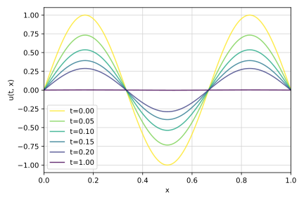

# Physics-informed neural nets

The goal of this project is to provide an introduction to physics-informed neural networks (PINNs).
For phenomena that can be mathematically described by certain differential equations,
PINNs establish a predictive modeling approach that is both physics-guided and data-driven.

Two notebooks provide a concise introduction and a practical demonstration
on the basis of a one-dimensional time-dependent heat transfer problem.

Everything here is work in progress at this point.

## Notebooks

- [Introduction](notebooks/intro.ipynb)
- [Heat equation example](notebooks/heat_equation_1d.ipynb)
